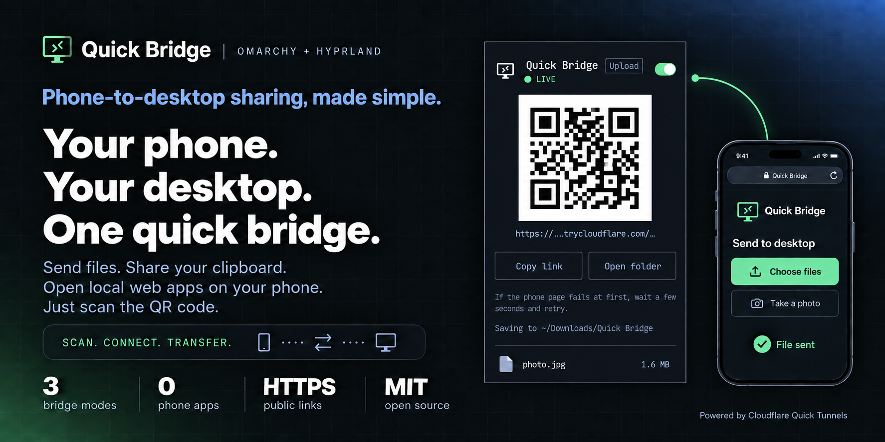

# Quick Bridge

An Omarchy bar plugin that opens a QR code and HTTPS link so this computer
and your phone can exchange files, or so a local HTTP server can be reached
from the phone.

Clicking the bar icon opens the panel. Choose **Upload**, **Download**, or
**Proxy**, then turn the session on. A local helper listens on `127.0.0.1`
and publishes it through a
[Cloudflare Quick Tunnel](https://trycloudflare.com/)
(`https://*.trycloudflare.com`) using the pure-Rust
[`cloudflare-quick-tunnel`](https://docs.rs/cloudflare-quick-tunnel) crate —
not the `cloudflared` app.

- **Upload** — scan the code on your phone and send a photo or document. It
  lands in `~/Downloads/Quick Bridge`.
- **Download** — share a file or the current clipboard. The phone scans the
  code and downloads it.
- **Proxy** — pick an HTTP port that is already listening on this machine
  (Vite, a local app, and so on). The phone opens that service over HTTPS.
- **Stop after transfer** — tear the tunnel down after the first successful
  upload or download.
- **Require password** — phone must type a 6-digit code shown on the desktop.
  The code is not in the QR or the link. **Proxy always requires this.**
  Upload and download default it off.

## Install

This plugin needs a Rust toolchain (`cargo` on `PATH`, including
`~/.cargo/bin`) the first time the helper is compiled, and network access to
crates.io for that build plus Cloudflare’s quick-tunnel edge at runtime.

```sh
omarchy plugin add https://github.com/cfaulkingham/quickbridge.git --enable
```

Optional, before the first panel open, compile the helper yourself so the
widget does not have to:

```sh
cd ~/.config/omarchy/plugins/io.github.cfaulkingham.quickbridge
cargo build --locked --release
```

From this folder while developing:

```sh
PLUGIN_ID="io.github.cfaulkingham.quickbridge"
PLUGIN_DIR="$HOME/.config/omarchy/plugins/$PLUGIN_ID"
mkdir -p "$PLUGIN_DIR"
rsync -a --delete --exclude .git --exclude target "$PWD/" "$PLUGIN_DIR/"
chmod +x "$PLUGIN_DIR/scripts/quickbridge" "$PLUGIN_DIR/scripts/copy-url" \
  "$PLUGIN_DIR/scripts/snapshot-clipboard"
omarchy-shell shell rescanPlugins
omarchy plugin enable "$PLUGIN_ID" --section right
```

Later starts reuse the cached binary in `~/.cache/quickbridge/` when the
plugin source has not changed.

## Usage

- Left-click the bridge icon to open the panel. The icon stays lit while a
  session is running. Right-click stops it.
- Closing the panel does **not** stop the tunnel. It stays up until you
  turn the switch off, press `s`, or right-click the bar icon.
- **Upload** — turn the switch on, scan the QR, pick files or take a photo.
- **Download** — **Share a file** (desktop file picker) or **Share
  clipboard**, then scan. Clipboard images and text are snapshotted
  immediately so a slow first compile cannot race the clipboard.
- **Proxy** — **Refresh ports**, then tap a listening HTTP port. The QR is
  the public origin of that service (no extra path prefix).
- `c` copies the link, `o` opens the upload folder, `u`/`d`/`p` switch
  modes, `f` picks a file, `b` shares the clipboard, `r` refreshes ports,
  `x` clears the recent-files list (files on disk stay). Escape closes
  the panel.
- Incoming uploads and completed downloads raise a desktop notification.
- An idle session stops itself after 15 minutes without activity
  (configurable). A live session also has a hard wall-clock limit of twice
  that, so a leaked link cannot stay up forever.

The first phone request can take 20–60s while Cloudflare publishes the
hostname (you may see a 530). After that the page loads. Cloudflare may also
show a brief browser check; wait it out. This computer's DNS cache sometimes
cannot resolve `*.trycloudflare.com` even while a phone on public DNS can.

Local web apps that emit absolute `http://127.0.0.1` redirects are rewritten
to relative URLs. Apps that hard-code `localhost` inside HTML or JavaScript
may still misbehave through the tunnel. WebSockets are not proxied.

## Configure

```sh
omarchy bar move io.github.cfaulkingham.quickbridge --section right
```

Widget settings (save folder, max file size, idle timeout, default stop-after)
live on the plugin entry in `~/.config/omarchy/shell.json`. The save folder
must be under your home directory (or your XDG Downloads folder). Per-file
size is 1–2048 MB; an upload session also stops after 32 files or eight times
the per-file cap.

## Security

The tunnel URL is public HTTPS. For upload and download, a random token in
the path is the first gate. Turn on **Require password** so a 6-digit code
shown only on this computer is a second gate. **Proxy always requires that
PIN** (the helper will not start a proxy without one): there is no extra
path token, so the random Cloudflare hostname plus the PIN are the secrets.

The helper listens only on localhost, allowlists
`https://*.trycloudflare.com`, sanitizes filenames, caps per-file and
per-session size, opens shared files with `O_NOFOLLOW`, and dies with the
Omarchy shell (`setpriv --pdeathsig TERM` plus process-group teardown).

Do not proxy admin UIs, databases, or anything that trusts LAN traffic.
Do not leave a live session unattended on an untrusted network. Treat the
link like a capability: it is copied on stdin to `wl-copy`, never in argv.

## Remove

```sh
omarchy plugin remove io.github.cfaulkingham.quickbridge
```

That removes the plugin from the bar and from
`~/.config/omarchy/plugins/io.github.cfaulkingham.quickbridge`.

These are **not** deleted and survive removal:

- Uploaded files in `~/Downloads/Quick Bridge`, or whatever save folder you
  configured
- The helper cache at `$XDG_CACHE_HOME/quickbridge` (default
  `~/.cache/quickbridge`), including the compiled binary and Cargo target dir
- Clipboard snapshots left in `$XDG_RUNTIME_DIR/quickbridge` if a session is
  killed before the helper unlinks them (cleared on logout)

## Dependencies

- Rust/`cargo` (first run, or whenever the helper source changes)
- Network access to crates.io (first compile) and Cloudflare’s quick-tunnel edge
- `setpriv` and `setsid` (util-linux, already on Omarchy)
- `wl-copy` / `wl-paste` for the link and clipboard sharing
- `omarchy-file-select` for the download file picker

## Credits

Public HTTPS links are provided by
[Cloudflare Quick Tunnels](https://trycloudflare.com/), Cloudflare's free
TryCloudflare service. How it works is in the
[Quick Tunnels docs](https://developers.cloudflare.com/cloudflare-one/networks/connectors/cloudflare-tunnel/do-more-with-tunnels/trycloudflare/).
This plugin is not affiliated with Cloudflare.
